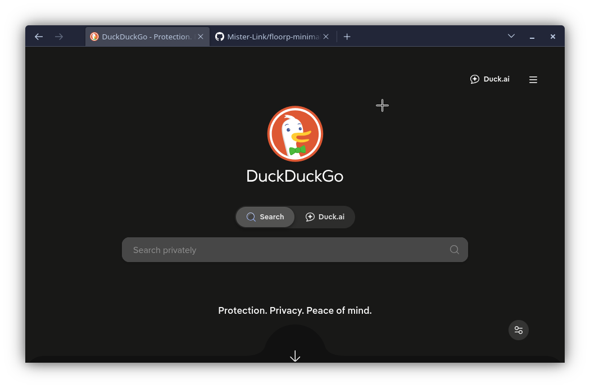
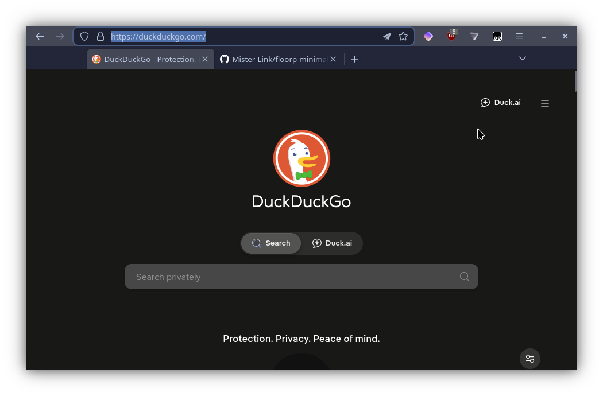

# floorp-minimal-ui

Minimal Floorp browser UI via `userChrome.css`. Hides the address bar off-screen to maximize content space, while keeping back/forward buttons and window controls always visible in the tab bar. Press `Ctrl+L` to expand the full toolbar.

## Preview

**Collapsed** — just the tab bar with navigation and window controls:



**Expanded** — full toolbar on Ctrl+L:



## Install

1. Enable `userChrome.css` support in Floorp:
   - Go to `about:config`
   - Set `toolkit.legacyUserProfileCustomizations.stylesheets` to `true`

2. Copy `userChrome.css` to your Floorp profile's `chrome/` folder:
   ```
   ~/.floorp/<profile>/chrome/userChrome.css
   ```

3. Restart Floorp.
